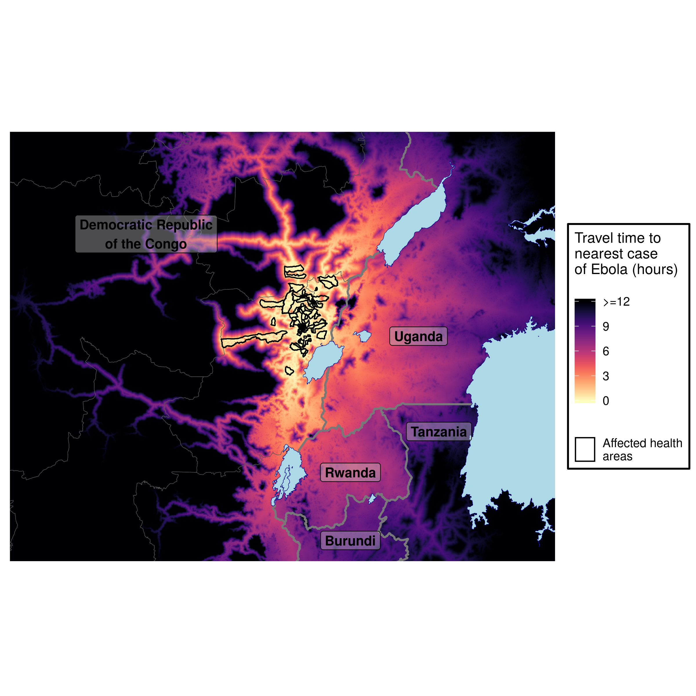
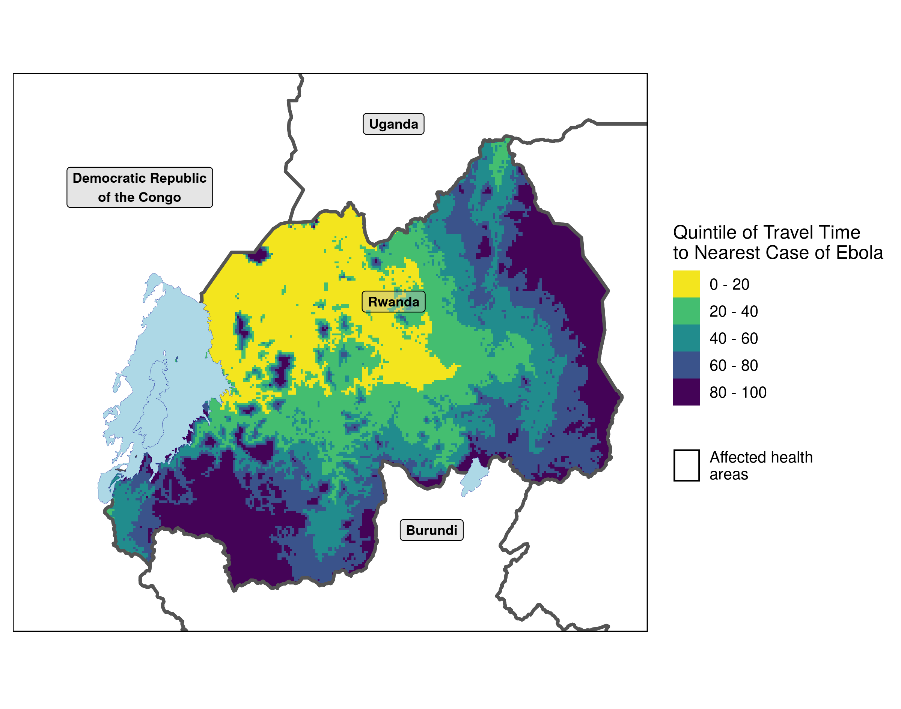
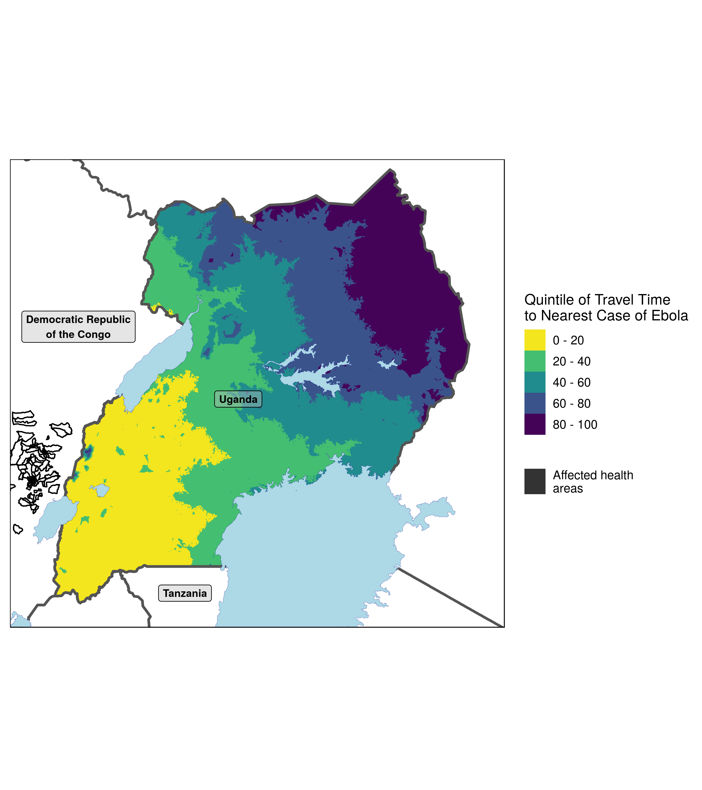

# Travel time analytics for the Ebola outbreak in the Kivus
Calculate and plot travel time to health areas infected with Ebola from surrounding area using publicly available data.
The plots produced with this code are displayed below:

Travel time plot - capped at 12 hours

Rwanda - relative travel time

Uganda - relative travel time

