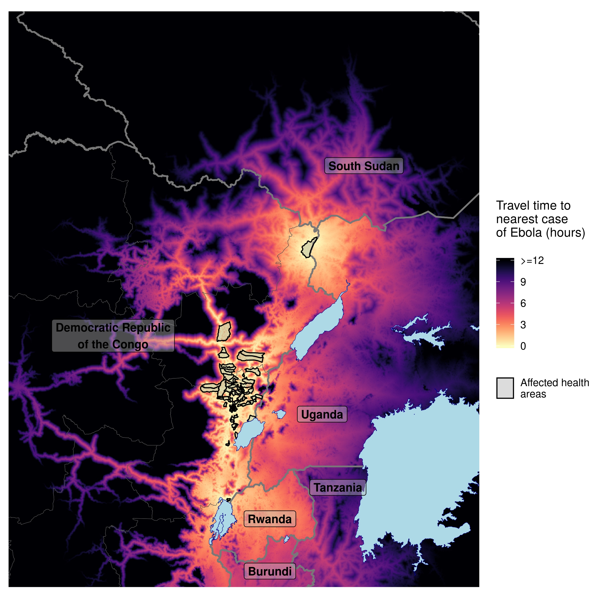
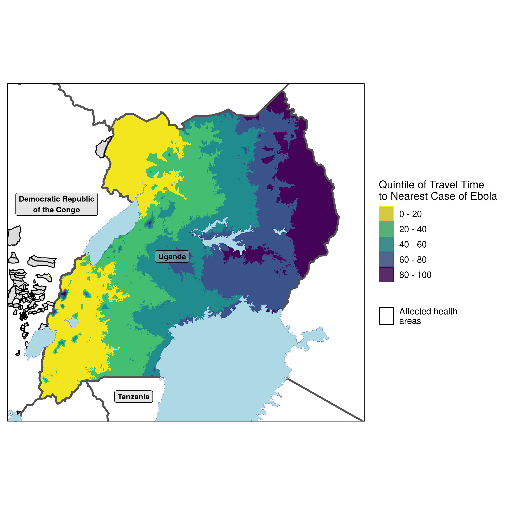
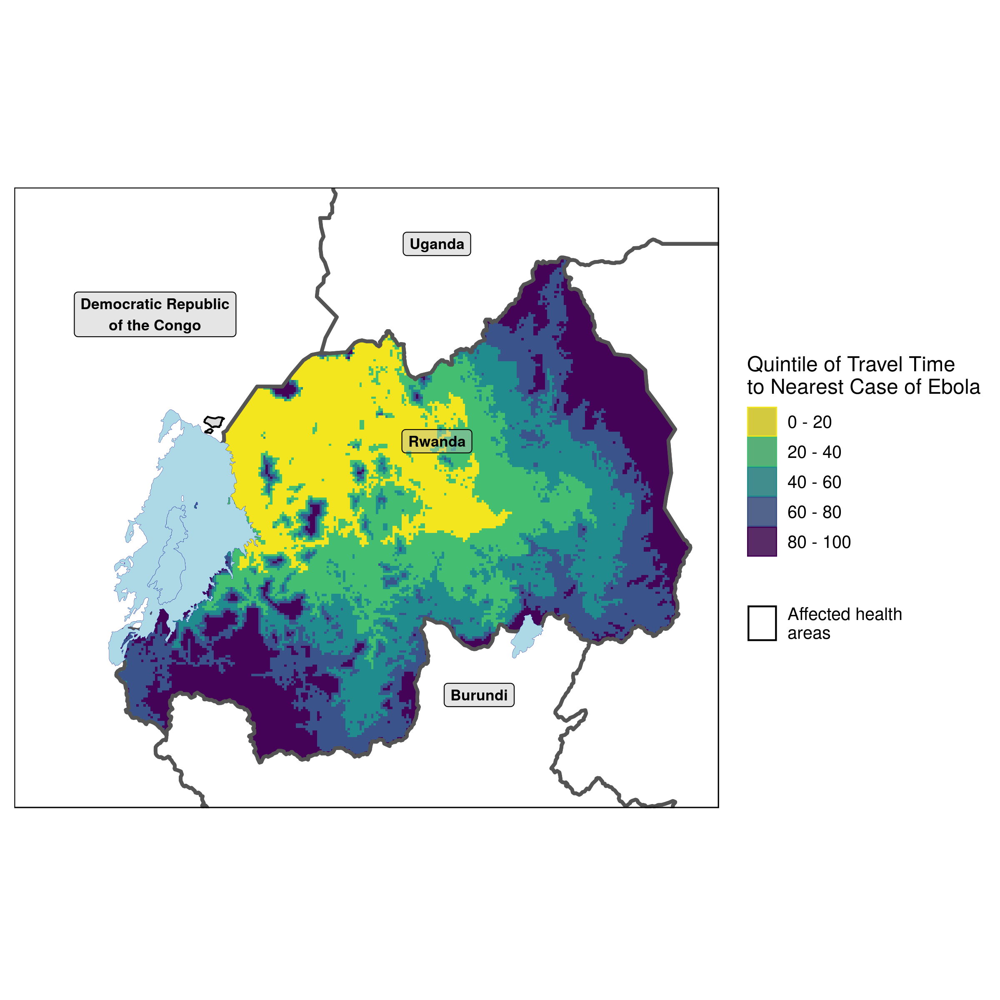
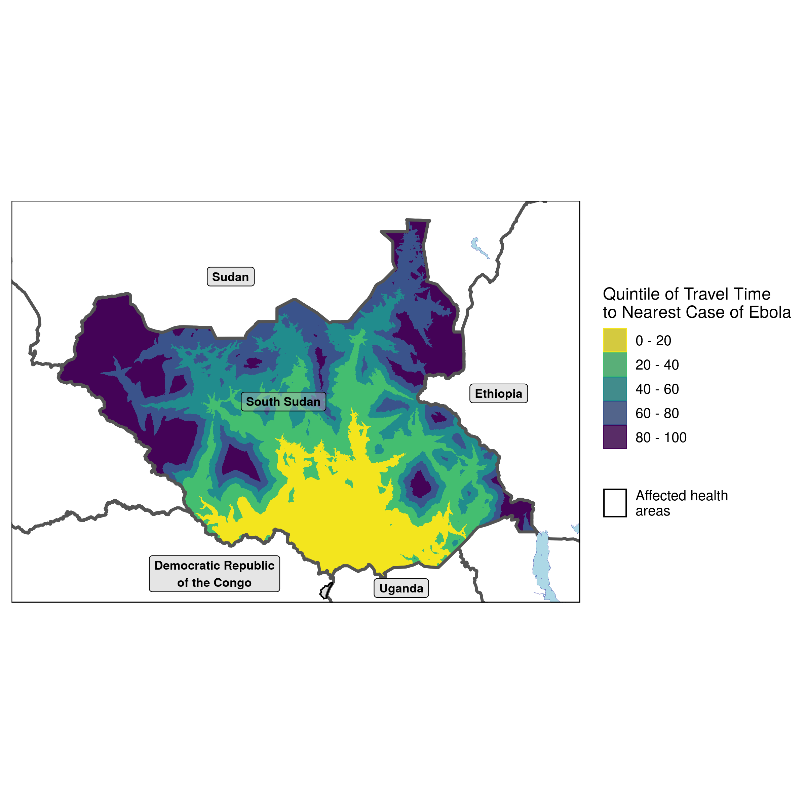
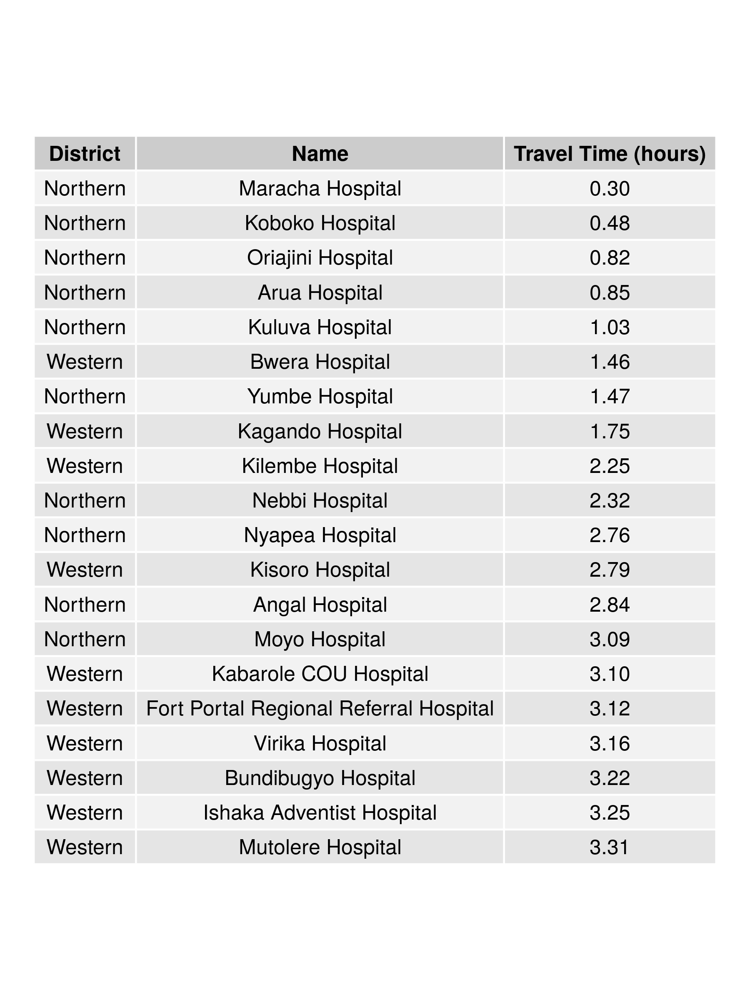
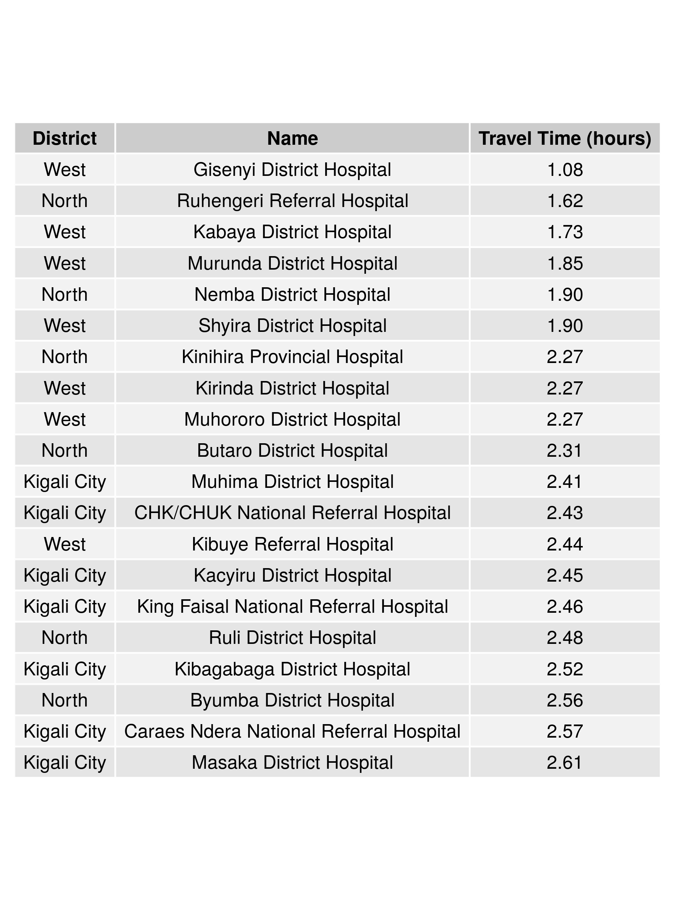
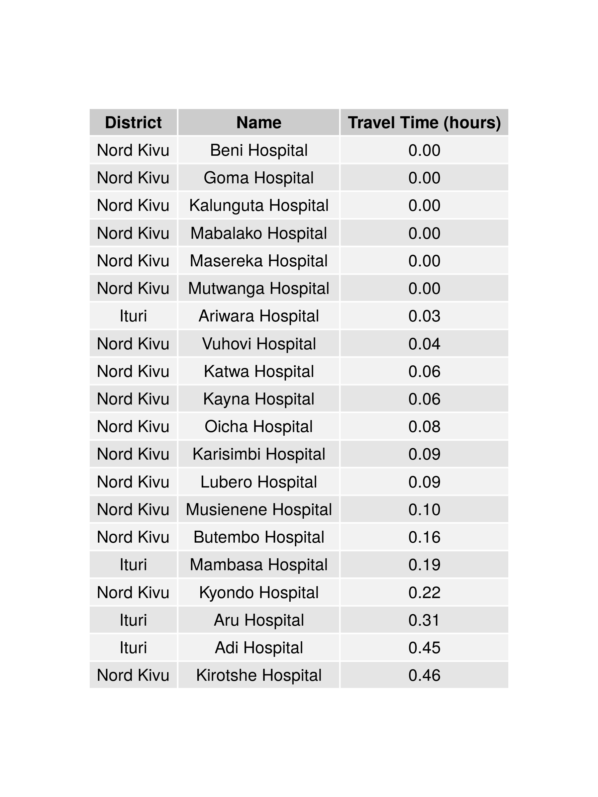
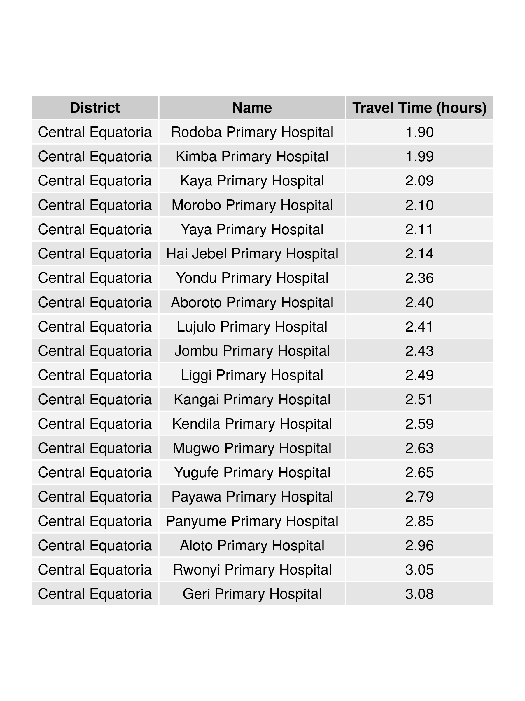

# Travel time analytics for the Ebola outbreak in the Kivus

With the ongoing outbreak in the Democratic Republic of the Congo, we were interested in applying openly available data to quantify the
travel time of populations impacted by Ebola.

The base travel time statistics are generated from friction layers evaluated by Daniel Weiss and colleagues at the Malaria Atlas Project
and shared via their R package malariaAtlas https://cran.r-project.org/web/packages/malariaAtlas/index.html. 
A tutorial on how this package can be used to generate estimates is available here: 
https://medium.com/@abertozz/mapping-travel-times-with-malariaatlas-and-friction-surfaces-f4960f584f08

Case data comes from Situation Reports from the World Health Organization and Ministry of Health in the Democratic Republic of the Congo.

_________________________________________________________________________________________________________________________________________

Travel time from districts reporting cases to areas in and around the Kivus, including neighbouring countries

Travel time from districts reporting cases to locations in Uganda, coloured by percentile rank

Travel time from districts reporting cases to locations in Rwanda, coloured by percentile rank

Travel time from districts reporting cases to locations in South Sudan, coloured by percentile rank

Rank order and travel time proximity of Ugandan hospitals to reported cases

Rank order and travel time proximity of Rwandan hospitals to reported cases

Rank order and travel time proximity of Congolese hospitals to reported cases

Rank order and travel time proximity of South Sudanese hospitals to reported cases

Outputs were last updated on 12 August 2019 and are based upon WHO Disease Outbreak News, August 8.
